# See++ Technical Deep Dive

This document provides a comprehensive technical analysis of the See++ C++ visualization tool, covering source code structure, data flow, technology stack analysis, and feasibility of extending it as a VS Code plugin.

## Table of Contents

1. [Source Code Structure](#source-code-structure)
2. [Data Flow & Execution Pipeline](#data-flow--execution-pipeline)
3. [Technology Stack Analysis](#technology-stack-analysis)
4. [Modern Stack Comparison & Gaps](#modern-stack-comparison--gaps)
5. [VS Code Extension Feasibility](#vs-code-extension-feasibility)
6. [Debugger Infrastructure Integration](#debugger-infrastructure-integration)
7. [Implementation Roadmap](#implementation-roadmap)

---

## Source Code Structure

### Component Architecture

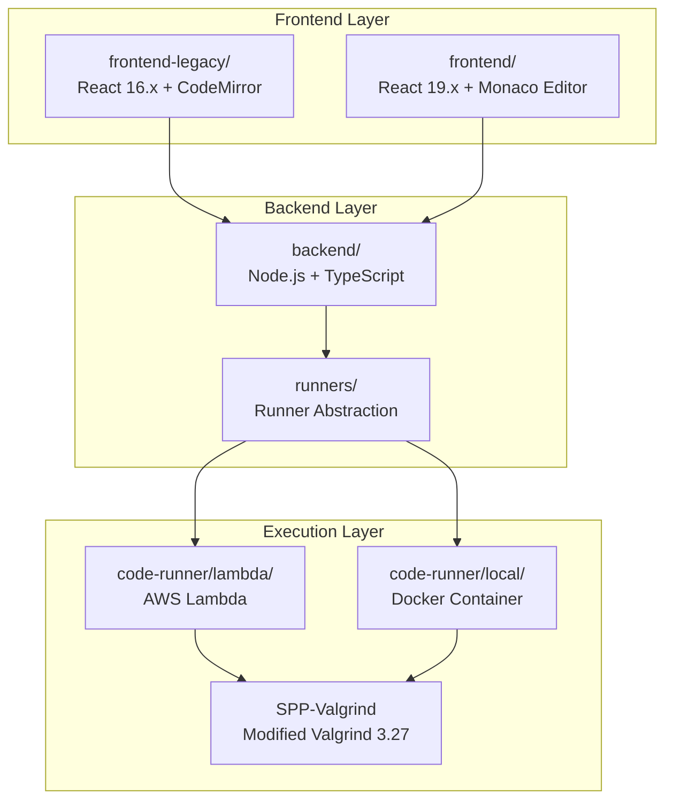

### Directory Structure

```
SeePlusPlus/
├── backend/                    # Node.js/TypeScript API Server
│   ├── src/
│   │   ├── index.ts           # Express server & API routes
│   │   ├── runners/           # Execution environment abstraction
│   │   │   ├── runner.interface.ts  # Common interface
│   │   │   ├── local.ts       # Local Docker runner
│   │   │   ├── lambda.ts      # AWS Lambda runner
│   │   │   └── index.ts       # Runner factory
│   │   ├── valgrind_utils.ts  # Trace preprocessing
│   │   └── parse_vg_trace.ts  # Valgrind trace parser
│   ├── package.json           # Dependencies (Express, AWS SDK)
│   └── tsconfig.json          # TypeScript configuration
│
├── frontend-legacy/           # Production React UI (Legacy)
│   ├── src/
│   │   ├── App.jsx           # Main application container
│   │   ├── editor/
│   │   │   └── Ide.jsx       # Code editor (CodeMirror)
│   │   ├── visualization/
│   │   │   ├── Visualization.jsx   # Memory visualization
│   │   │   ├── StackFrameCard.jsx  # Stack frame display
│   │   │   ├── VariableCard.jsx    # Variable inspector
│   │   │   └── Output.jsx    # Program output
│   │   ├── utils/
│   │   │   ├── Api.js        # Backend communication
│   │   │   └── VisualizationTool.js # Visualization engine
│   │   └── models/           # Data models
│   └── package.json          # Dependencies (React 16.x, Konva.js)
│
├── frontend/                  # Modern React UI (Under Development)
│   ├── src/
│   │   ├── App.tsx           # TypeScript-based app
│   │   └── components/       # Modern React components
│   └── package.json          # Dependencies (React 19.x, Monaco)
│
├── code-runner/              # Isolated execution environment
│   ├── lambda/               # AWS Lambda handler
│   │   ├── handler.py        # Python Lambda entry point
│   │   ├── Dockerfile.prod   # Lambda container image
│   │   └── deploy-to-aws.sh  # Deployment script
│   ├── local/                # Local Docker runner
│   │   ├── entrypoint.sh     # Container entry script
│   │   └── Dockerfile        # Local execution environment
│   └── SPP-Valgrind/         # Git submodule (modified Valgrind)
│       └── [Valgrind source with C++ tracing patches]
│
├── copilot/                  # AWS infrastructure as code
│   ├── backend/manifest.yml  # Backend service config
│   ├── frontend-legacy/manifest.yml
│   ├── frontend/manifest.yml
│   └── environments/         # Test/prod configurations
│
└── docs/                     # Documentation
    ├── architecture.md       # System architecture
    ├── development.md        # Local dev guide
    ├── infrastructure.md     # AWS infrastructure
    └── deployment.md         # Deployment procedures
```

### Key Source Files Analysis

#### Backend Core (`backend/src/index.ts`)

**Purpose**: Express.js API server that orchestrates code execution

**Key Responsibilities**:
- Receives C++ code from frontend via POST `/api/run`
- Preprocesses code (adds `#define union struct`)
- Generates unique ID (hash for caching, UUID for dev)
- Delegates execution to runner abstraction
- Parses Valgrind traces into visualization format
- Returns structured trace data to frontend

**Code Flow**:
```typescript
POST /api/run
  → Validate code input
  → Preprocess code (#define union struct)
  → Generate unique ID (SHA-256 hash or UUID)
  → runner.run(preprocessedCode, uniqueId)
  → buildValgrindResponse(results)
  → Return JSON trace to frontend
```

#### Runner Abstraction (`backend/src/runners/`)

**Design Pattern**: Strategy pattern for execution environment abstraction

**Interface** (`runner.interface.ts`):
```typescript
interface RunnerResult {
    ccStdout: string;    // Compilation output
    ccStderr: string;    // Compilation errors
    stdout: string;      // Program stdout
    stderr: string;      // Program stderr
    traceContent: string; // Valgrind JSON trace
}

interface TraceRunner {
    run(code: string, uniqueId: string): Promise<RunnerResult>;
}
```

**Implementations**:

1. **LocalRunner** (`local.ts`):
   - Writes code to `/tmp/spp-usercode/[uuid]/input/`
   - Spawns Docker container with volume mounts
   - Waits for container completion
   - Reads results from `/tmp/spp-usercode/[uuid]/output/`

2. **LambdaRunner** (`lambda.ts`):
   - Uses AWS SDK to invoke Lambda function
   - Sends code as synchronous payload
   - Receives complete execution results in response
   - No S3 dependency (direct response)

#### Valgrind Trace Parser (`backend/src/parse_vg_trace.ts`)

**Purpose**: Convert raw Valgrind output to frontend-consumable format

**Key Features**:
- Parses JSON records separated by `=== pg_trace_inst ===`
- Extracts execution points with line numbers, stack frames, heap state
- Handles stdout buffering (shifts stdout by 1 step for Lambda mode)
- Filters redundant steps (ONLY_ONE_REC_PER_LINE)
- Limits trace length (MAX_STEPS = 1000)

**Data Structure**:
```typescript
interface ExecutionPoint {
    event: string;              // 'call', 'return', 'step', etc.
    line: number;               // Source line number
    funcName: string;           // Current function
    stackToRender: Array<any>;  // Call stack with variables
    globals: any;               // Global variables
    heap: any;                  // Heap memory state
    orderedGlobals: string[];   // Variable ordering
    stdout: string;             // Accumulated output
    exceptionMsg?: string;      // Error messages
}
```

#### Frontend Visualization (`frontend-legacy/src/`)

**Main Components**:

1. **App.jsx**: Application state management
   - Manages trace data and timeline position
   - Handles keyboard shortcuts (arrows, play/pause)
   - Coordinates visualization updates

2. **Ide.jsx**: Code editor interface
   - CodeMirror integration with C++ syntax highlighting
   - Submit button to trigger execution
   - Line number navigation

3. **Visualization.jsx**: Memory state rendering
   - Konva.js canvas for drawing stack/heap
   - Stack frames with variables
   - Heap memory blocks with pointers
   - Pointer arrows connecting references

4. **VisualizationTool.js**: Core visualization logic
   - Layout algorithm for stack and heap
   - Arrow rendering for pointer relationships
   - Memory leak detection (orphaned heap blocks)
   - Auto-layout optimization

#### Code Runner Lambda (`code-runner/lambda/handler.py`)

**Execution Pipeline**:
```python
def lambda_handler(event, context):
    1. Extract C++ code from event
    2. Preprocess code (if needed)
    3. Check S3 cache (optional)
    4. Write code to /tmp/[uuid]/main.cpp
    5. Compile with g++ -g -O0
    6. If compilation succeeds:
       a. Run under Valgrind with custom flags
       b. Parse Valgrind output
    7. Collect all outputs (compilation, execution, trace)
    8. Cache to S3 (if enabled)
    9. Return complete results
```

**Key Valgrind Command**:
```bash
valgrind --tool=lackey \
         --trace-mem=yes \
         --basic-counts=no \
         --fnname=yes \
         --json-trace \
         ./main
```

---

## Data Flow & Execution Pipeline

### End-to-End Data Flow

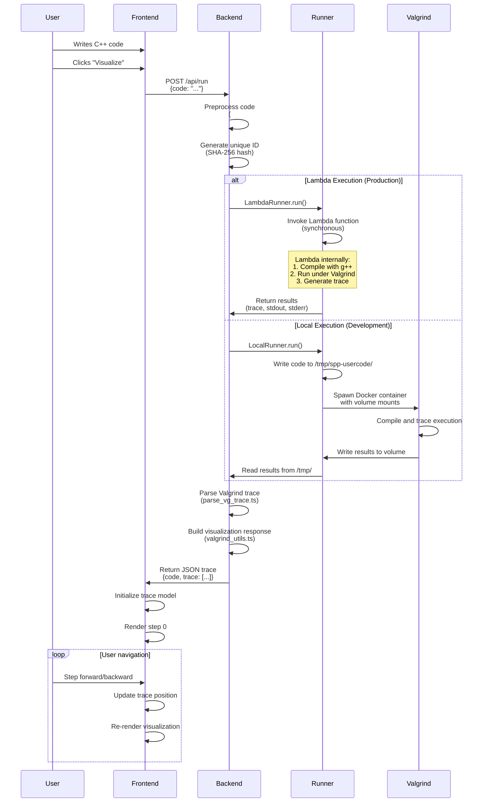

### Valgrind Trace Generation

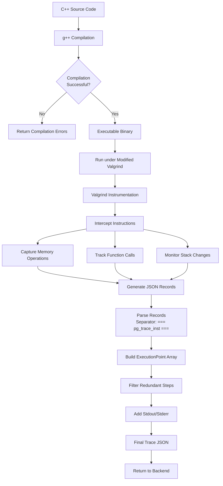

### Frontend Rendering Pipeline

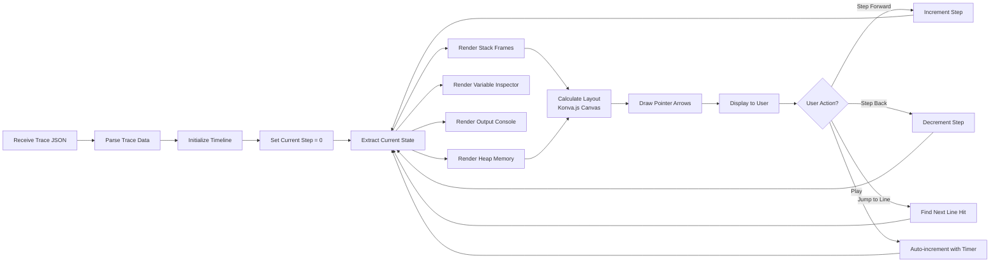

### Memory State Tracking

The modified Valgrind tracks memory operations at multiple levels:

1. **Stack Frame Tracking**:
   - Function entry/exit (CALL/RET instructions)
   - Local variable allocations
   - Parameter passing
   - Return addresses

2. **Heap Tracking**:
   - `new` / `malloc` allocations
   - `delete` / `free` deallocations
   - Memory addresses and sizes
   - Object relationships

3. **Pointer Tracking**:
   - Reference assignments
   - Pointer arithmetic
   - Dereferencing operations
   - Address-of operations (`&`)

4. **Variable Value Tracking**:
   - Read/write operations
   - Type information (from debug symbols)
   - Current values at each step

**Trace Record Format** (generated by Valgrind):
```json
{
  "line": 42,
  "event": "step",
  "func_name": "main",
  "stack": [
    {
      "frame_id": 1,
      "func_name": "main",
      "is_highlighted": true,
      "ordered_varnames": ["x", "ptr"],
      "encoded_locals": {
        "x": ["42", "int"],
        "ptr": ["0x7ffe1234", "int*"]
      }
    }
  ],
  "heap": {
    "0x55555555a2a0": ["64", "int"]
  },
  "globals": {}
}
```

---

## Technology Stack Analysis

### Current Technology Stack

#### Frontend (Legacy - Production)

| Component | Technology | Version | Purpose |
|-----------|-----------|---------|---------|
| **Framework** | React | 16.3.1 | UI framework |
| **Language** | JavaScript | ES6 | Programming language |
| **Code Editor** | CodeMirror | 5.36.0 | Syntax highlighting |
| **Visualization** | Konva.js | 2.0.3 | Canvas-based rendering |
| **Layout** | Dagre | 0.8.2 | Graph layout algorithm |
| **Build Tool** | Create React App | 1.1.4 | Build toolchain |
| **HTTP Client** | whatwg-fetch | 2.0.4 | Polyfill for fetch API |

#### Frontend (New - Beta)

| Component | Technology | Version | Purpose |
|-----------|-----------|---------|---------|
| **Framework** | React | 19.x | Modern UI framework |
| **Language** | TypeScript | Latest | Type-safe development |
| **Code Editor** | Monaco Editor | Latest | VS Code editor component |
| **Build Tool** | Vite/CRA | Latest | Modern build tool |

#### Backend

| Component | Technology | Version | Purpose |
|-----------|-----------|---------|---------|
| **Runtime** | Node.js | 18+ | JavaScript runtime |
| **Language** | TypeScript | 5.7.3 | Type-safe development |
| **Framework** | Express | 4.21.2 | Web framework |
| **AWS SDK** | @aws-sdk/client-lambda | 3.917.0 | Lambda invocation |
| **AWS SDK** | @aws-sdk/client-s3 | 3.600.0 | S3 operations |
| **AWS SDK** | @aws-sdk/client-ecs | 3.600.0 | ECS operations |
| **CORS** | cors | 2.8.5 | Cross-origin support |

#### Code Runner

| Component | Technology | Version | Purpose |
|-----------|-----------|---------|---------|
| **Runtime** | AWS Lambda | Python 3.12 | Serverless execution |
| **Compiler** | GCC (g++) | 11+ | C++ compilation |
| **Debugger** | Valgrind | 3.27.0 (modified) | Execution tracing |
| **Container** | Docker | 20+ | Local isolation |
| **Base OS** | Amazon Linux 2023 | Latest | Lambda runtime |

#### Infrastructure

| Component | Technology | Purpose |
|-----------|-----------|---------|
| **IaC** | AWS Copilot | Infrastructure as code |
| **Container Orchestration** | AWS ECS | Service deployment |
| **Compute** | AWS Lambda | Serverless execution |
| **Storage** | AWS S3 | Optional caching |
| **Load Balancer** | AWS ALB | Traffic distribution |
| **Networking** | AWS VPC | Network isolation |
| **CI/CD** | Manual | Deployment process |

### Technology Stack Diagram

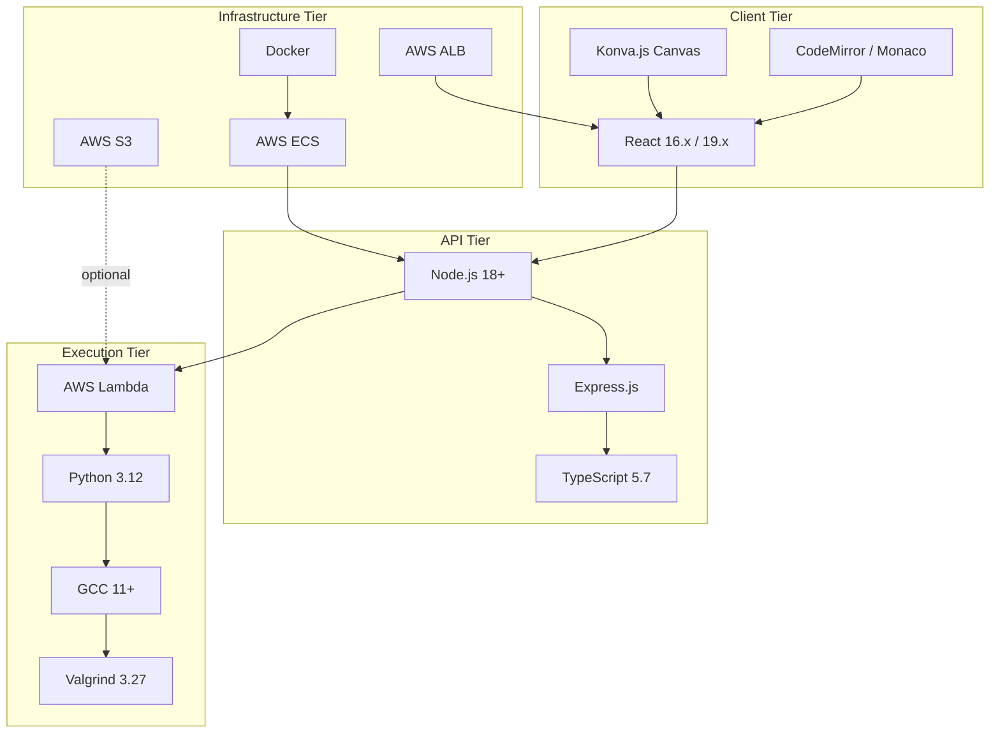

---

## Modern Stack Comparison & Gaps

### Gap Analysis: Current vs. Modern Stack

#### Frontend Gaps

| Aspect | Current State | Modern Best Practice | Gap Severity |
|--------|---------------|---------------------|--------------|
| **React Version** | 16.3.1 (legacy) / 19.x (new) | React 18+/19 with Concurrent Features | Medium (legacy) / None (new) |
| **Type Safety** | JavaScript (legacy) / TypeScript (new) | TypeScript with strict mode | High (legacy) / Low (new) |
| **Build Tool** | CRA 1.1.4 (outdated) | Vite / Next.js | High |
| **State Management** | Component state | Zustand / Redux Toolkit / Jotai | Medium |
| **Testing** | None | Vitest / Jest + React Testing Library | Critical |
| **Code Editor** | CodeMirror 5.x | Monaco Editor (VS Code) | Medium (legacy) / None (new) |
| **Visualization** | Konva.js | React Flow / D3.js / Three.js | Low |
| **Styling** | Inline styles | Tailwind CSS / CSS Modules | Medium |
| **Bundling** | Webpack (CRA) | Vite / Turbopack | Medium |

#### Backend Gaps

| Aspect | Current State | Modern Best Practice | Gap Severity |
|--------|---------------|---------------------|--------------|
| **API Design** | REST | GraphQL / tRPC / REST with OpenAPI | Low |
| **Authentication** | None | JWT / OAuth2 / Auth0 | Medium |
| **Rate Limiting** | None | Express-rate-limit / Redis | High |
| **Validation** | Manual | Zod / Yup / Joi | Medium |
| **Error Handling** | Basic | Structured error middleware | Medium |
| **Logging** | console.log | Winston / Pino with structured logging | High |
| **Monitoring** | CloudWatch only | Datadog / New Relic / Sentry | Medium |
| **Testing** | None | Jest / Supertest for API testing | Critical |
| **Documentation** | Manual | OpenAPI / Swagger auto-gen | Medium |
| **Caching** | Optional S3 | Redis / Memcached | Medium |

#### DevOps & Infrastructure Gaps

| Aspect | Current State | Modern Best Practice | Gap Severity |
|--------|---------------|---------------------|--------------|
| **CI/CD** | Manual deployment | GitHub Actions / GitLab CI | High |
| **Testing Pipeline** | None | Automated test suite in CI | Critical |
| **Code Quality** | No linting | ESLint + Prettier + Husky hooks | High |
| **Security Scanning** | None | Snyk / OWASP Dependency Check | High |
| **Container Security** | Basic | Trivy / Clair scanning | Medium |
| **Secrets Management** | Environment variables | AWS Secrets Manager / HashiCorp Vault | Medium |
| **Infrastructure Testing** | Manual | Terraform tests / CDK assertions | Medium |
| **Deployment Strategy** | Manual script | GitOps (ArgoCD / Flux) | Medium |

#### Debugger & Tooling Gaps

| Aspect | Current State | Modern Best Practice | Gap Severity |
|--------|---------------|---------------------|--------------|
| **Debug Protocol** | Custom Valgrind trace | Debug Adapter Protocol (DAP) | High |
| **IDE Integration** | Web-only | VS Code extension | High |
| **Source Maps** | None | Full source mapping | Medium |
| **Breakpoints** | Line-based only | Conditional / logpoints / data breakpoints | High |
| **Watch Expressions** | No custom expressions | Evaluate arbitrary expressions | High |
| **Call Stack** | Read-only visualization | Interactive stack navigation | Medium |
| **Multi-threading** | Not supported | Thread-aware debugging | Critical |
| **Remote Debugging** | Not applicable | Remote attach support | Low |

### Modernization Priority Matrix

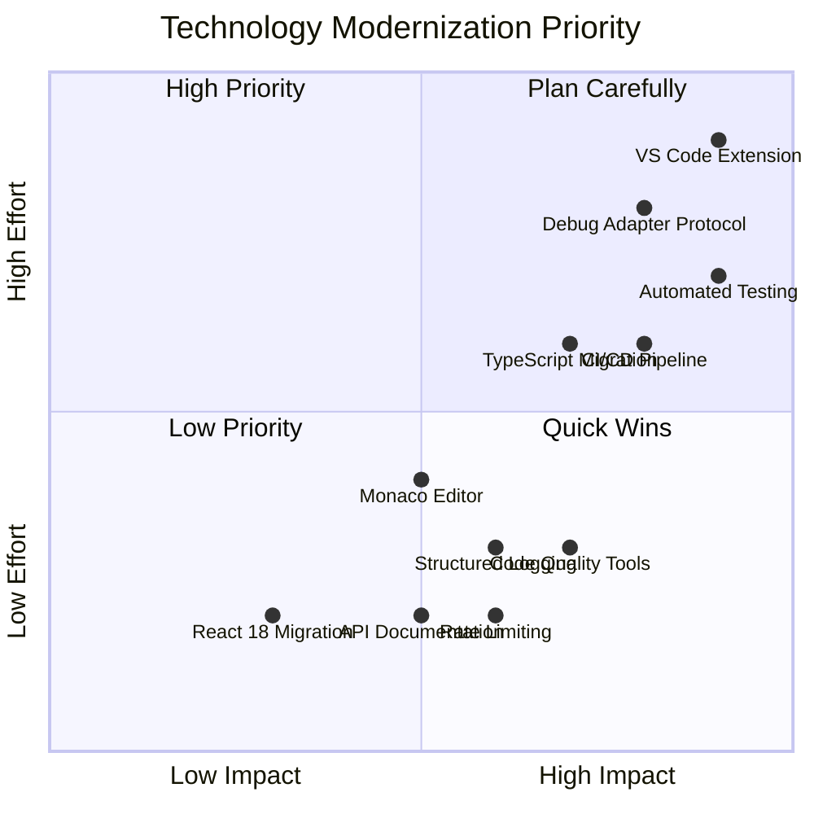

### Technology Stack Recommendations

#### Short-term (0-3 months)
1. **Add CI/CD Pipeline**: GitHub Actions for automated deployment
2. **Implement Testing**: Jest + React Testing Library
3. **Add Linting**: ESLint + Prettier with pre-commit hooks
4. **Rate Limiting**: Protect API from abuse
5. **Structured Logging**: Replace console.log with Winston/Pino

#### Medium-term (3-6 months)
1. **Complete TypeScript Migration**: Migrate legacy frontend
2. **Implement DAP**: Prepare for VS Code integration
3. **Add Monitoring**: Sentry for error tracking
4. **Security Scanning**: Automated vulnerability checks
5. **API Documentation**: OpenAPI/Swagger specification

#### Long-term (6-12 months)
1. **VS Code Extension**: Full IDE integration
2. **Modern Build System**: Migrate to Vite
3. **Enhanced Debugging**: Conditional breakpoints, watch expressions
4. **Multi-threading Support**: Thread-aware debugging
5. **Advanced Visualizations**: 3D memory visualization options

---

## VS Code Extension Feasibility

### Why VS Code Extension Makes Sense

1. **Native Developer Workflow**: Developers already write C++ in VS Code
2. **Integrated Debugging**: Seamless debugging experience without context switching
3. **Monaco Editor**: Reuse existing Monaco editor (same as VS Code)
4. **Debug Adapter Protocol**: Standard debugging interface
5. **Rich Ecosystem**: Leverage VS Code extension APIs

### VS Code Extension Architecture

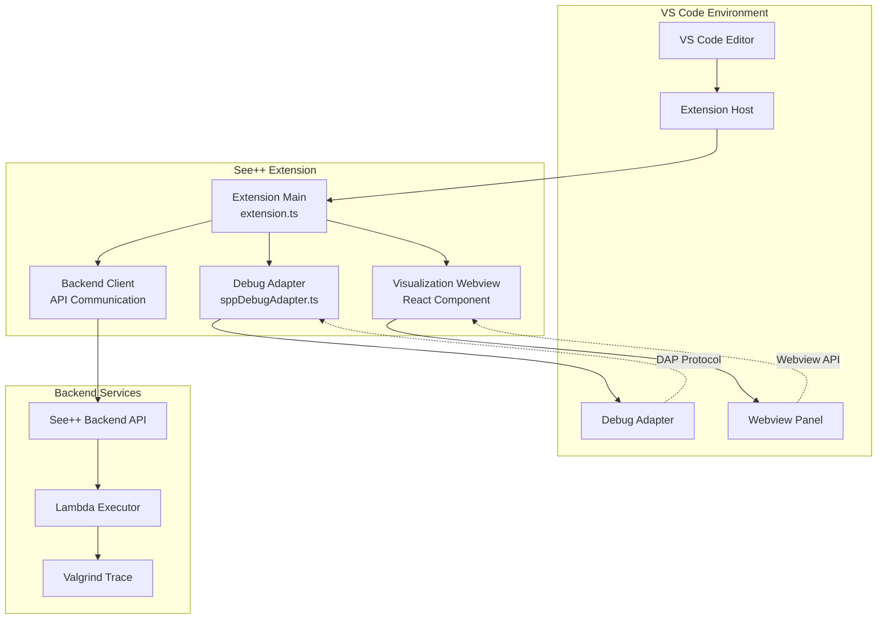

### Debug Adapter Protocol (DAP) Integration

The Debug Adapter Protocol is a standard protocol between editors and debuggers. See++ can implement a custom debug adapter.

#### DAP Flow for See++

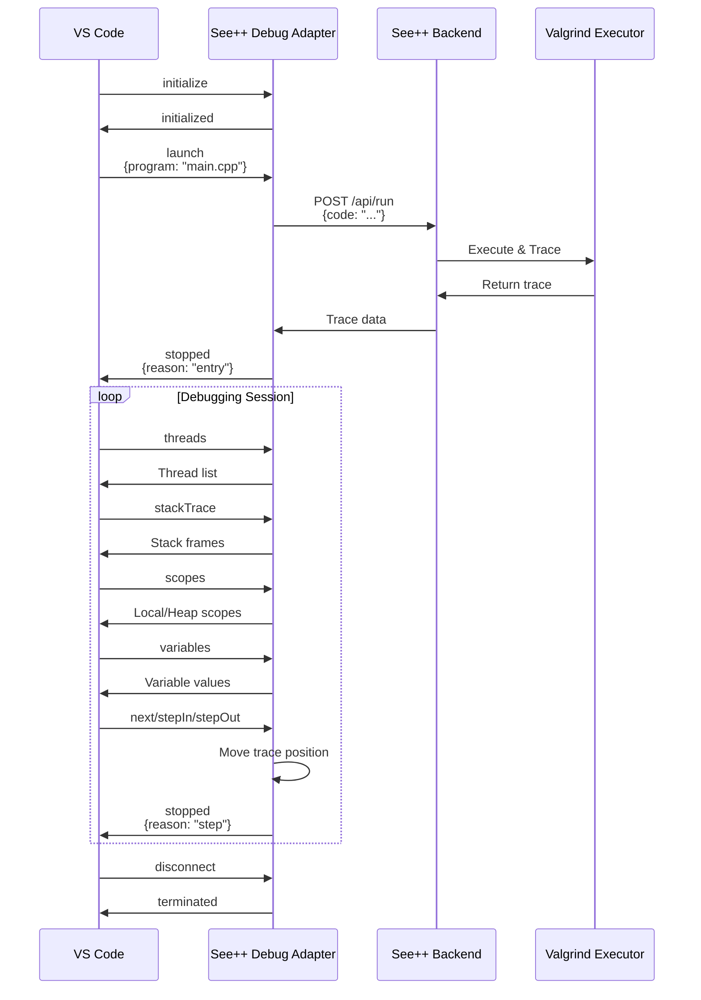

#### DAP Message Examples

**Launch Request**:
```json
{
  "command": "launch",
  "arguments": {
    "program": "${workspaceFolder}/main.cpp",
    "cwd": "${workspaceFolder}",
    "stopOnEntry": true
  }
}
```

**Stack Trace Response**:
```json
{
  "command": "stackTrace",
  "body": {
    "stackFrames": [
      {
        "id": 1,
        "name": "main",
        "source": {
          "path": "/workspace/main.cpp"
        },
        "line": 10,
        "column": 5
      }
    ]
  }
}
```

**Variables Response**:
```json
{
  "command": "variables",
  "body": {
    "variables": [
      {
        "name": "x",
        "value": "42",
        "type": "int",
        "variablesReference": 0
      },
      {
        "name": "ptr",
        "value": "0x7ffe1234",
        "type": "int*",
        "variablesReference": 1001
      }
    ]
  }
}
```

### Extension Component Breakdown

#### 1. Extension Entry Point (`extension.ts`)

```typescript
import * as vscode from 'vscode';
import { SppDebugAdapterFactory } from './debugAdapter';
import { SppVisualizationPanel } from './visualizationPanel';

export function activate(context: vscode.ExtensionContext) {
    // Register debug adapter
    context.subscriptions.push(
        vscode.debug.registerDebugAdapterDescriptorFactory(
            'spp-cpp',
            new SppDebugAdapterFactory()
        )
    );
    
    // Register visualization command
    context.subscriptions.push(
        vscode.commands.registerCommand('spp.visualize', () => {
            SppVisualizationPanel.createOrShow(context.extensionUri);
        })
    );
    
    // Register configuration provider
    context.subscriptions.push(
        vscode.debug.registerDebugConfigurationProvider(
            'spp-cpp',
            new SppConfigurationProvider()
        )
    );
}
```

#### 2. Debug Adapter (`sppDebugAdapter.ts`)

```typescript
import {
    DebugSession,
    InitializedEvent,
    StoppedEvent,
    Thread,
    StackFrame,
    Scope,
    Variable
} from '@vscode/debugadapter';
import { DebugProtocol } from '@vscode/debugprotocol';

export class SppDebugSession extends DebugSession {
    private traceData: ExecutionTrace;
    private currentStep: number = 0;
    
    protected async launchRequest(
        response: DebugProtocol.LaunchResponse,
        args: LaunchRequestArguments
    ) {
        // Read source file
        const sourceCode = readFileSync(args.program, 'utf-8');
        
        // Send to See++ backend
        const trace = await fetch('http://localhost:3000/api/run', {
            method: 'POST',
            body: JSON.stringify({ code: sourceCode })
        }).then(r => r.json());
        
        this.traceData = trace;
        this.currentStep = 0;
        
        this.sendEvent(new InitializedEvent());
        this.sendEvent(new StoppedEvent('entry', 1));
        this.sendResponse(response);
    }
    
    protected threadsRequest(response: DebugProtocol.ThreadsResponse) {
        response.body = {
            threads: [new Thread(1, "Main Thread")]
        };
        this.sendResponse(response);
    }
    
    protected stackTraceRequest(
        response: DebugProtocol.StackTraceResponse,
        args: DebugProtocol.StackTraceArguments
    ) {
        const step = this.traceData.trace[this.currentStep];
        const frames: StackFrame[] = step.stackToRender.map((frame, idx) => 
            new StackFrame(
                idx,
                frame.func_name,
                new Source(args.program),
                frame.line
            )
        );
        
        response.body = { stackFrames: frames };
        this.sendResponse(response);
    }
    
    protected nextRequest(
        response: DebugProtocol.NextResponse,
        args: DebugProtocol.NextArguments
    ) {
        this.currentStep++;
        this.sendEvent(new StoppedEvent('step', 1));
        this.sendResponse(response);
    }
    
    // Implement other DAP methods...
}
```

#### 3. Visualization Panel (`visualizationPanel.ts`)

```typescript
import * as vscode from 'vscode';

export class SppVisualizationPanel {
    public static currentPanel: SppVisualizationPanel | undefined;
    private readonly _panel: vscode.WebviewPanel;
    private _disposables: vscode.Disposable[] = [];
    
    public static createOrShow(extensionUri: vscode.Uri) {
        const column = vscode.window.activeTextEditor
            ? vscode.window.activeTextEditor.viewColumn
            : undefined;
        
        if (SppVisualizationPanel.currentPanel) {
            SppVisualizationPanel.currentPanel._panel.reveal(column);
            return;
        }
        
        const panel = vscode.window.createWebviewPanel(
            'sppVisualization',
            'See++ Memory Visualization',
            column || vscode.ViewColumn.One,
            {
                enableScripts: true,
                localResourceRoots: [
                    vscode.Uri.joinPath(extensionUri, 'media')
                ]
            }
        );
        
        SppVisualizationPanel.currentPanel = new SppVisualizationPanel(
            panel,
            extensionUri
        );
    }
    
    private constructor(
        panel: vscode.WebviewPanel,
        extensionUri: vscode.Uri
    ) {
        this._panel = panel;
        this._panel.webview.html = this._getHtmlForWebview(
            this._panel.webview
        );
        
        // Listen for messages from webview
        this._panel.webview.onDidReceiveMessage(
            message => {
                switch (message.command) {
                    case 'stepForward':
                        vscode.debug.activeDebugSession?.customRequest('next');
                        break;
                    case 'stepBackward':
                        // Custom command to step backward in trace
                        break;
                }
            },
            null,
            this._disposables
        );
    }
    
    private _getHtmlForWebview(webview: vscode.Webview): string {
        // Load React app built for webview
        const scriptUri = webview.asWebviewUri(
            vscode.Uri.joinPath(this._extensionUri, 'media', 'main.js')
        );
        
        return `<!DOCTYPE html>
        <html>
        <head>
            <meta charset="UTF-8">
            <meta name="viewport" content="width=device-width, initial-scale=1.0">
        </head>
        <body>
            <div id="root"></div>
            <script src="${scriptUri}"></script>
        </body>
        </html>`;
    }
}
```

#### 4. package.json Configuration

```json
{
  "name": "seepp-vscode",
  "displayName": "See++ C++ Debugger",
  "version": "1.0.0",
  "engines": {
    "vscode": "^1.85.0"
  },
  "categories": ["Debuggers", "Visualization"],
  "activationEvents": [
    "onDebug",
    "onCommand:spp.visualize"
  ],
  "main": "./out/extension.js",
  "contributes": {
    "debuggers": [
      {
        "type": "spp-cpp",
        "label": "See++ C++ Debugger",
        "languages": ["cpp", "c"],
        "configurationAttributes": {
          "launch": {
            "required": ["program"],
            "properties": {
              "program": {
                "type": "string",
                "description": "Path to C++ file",
                "default": "${file}"
              },
              "backend": {
                "type": "string",
                "description": "See++ backend URL",
                "default": "http://localhost:3000"
              }
            }
          }
        },
        "configurationSnippets": [
          {
            "label": "See++: Debug C++ file",
            "body": {
              "type": "spp-cpp",
              "request": "launch",
              "name": "See++ Debug",
              "program": "^\"\\${file}\""
            }
          }
        ]
      }
    ],
    "commands": [
      {
        "command": "spp.visualize",
        "title": "See++: Open Memory Visualization"
      }
    ]
  },
  "dependencies": {
    "@vscode/debugadapter": "^1.65.0",
    "@vscode/debugprotocol": "^1.65.0"
  }
}
```

### Extension Features Roadmap

#### Phase 1: Basic Debug Adapter (MVP)
- [ ] Launch C++ files from VS Code
- [ ] Send code to backend for tracing
- [ ] Display stack frames in VS Code debug view
- [ ] Display variables in VS Code variables view
- [ ] Basic step forward/backward navigation

#### Phase 2: Enhanced Visualization
- [ ] Webview panel with memory visualization
- [ ] Sync webview with debug session
- [ ] Interactive heap exploration
- [ ] Pointer relationship visualization
- [ ] Memory leak highlighting

#### Phase 3: Advanced Features
- [ ] Conditional breakpoints
- [ ] Watch expressions
- [ ] Data breakpoints (break on value change)
- [ ] Logpoints (log without stopping)
- [ ] Multi-file project support
- [ ] Hover tooltips with variable values

#### Phase 4: IDE Integration
- [ ] IntelliSense integration
- [ ] Code actions (e.g., "Visualize this function")
- [ ] Problem markers for memory leaks
- [ ] Testing integration
- [ ] Remote debugging support

---

## Debugger Infrastructure Integration

### Current Debugger Architecture

See++ uses a **modified Valgrind** as its debugger infrastructure. Understanding this is crucial for VS Code integration.

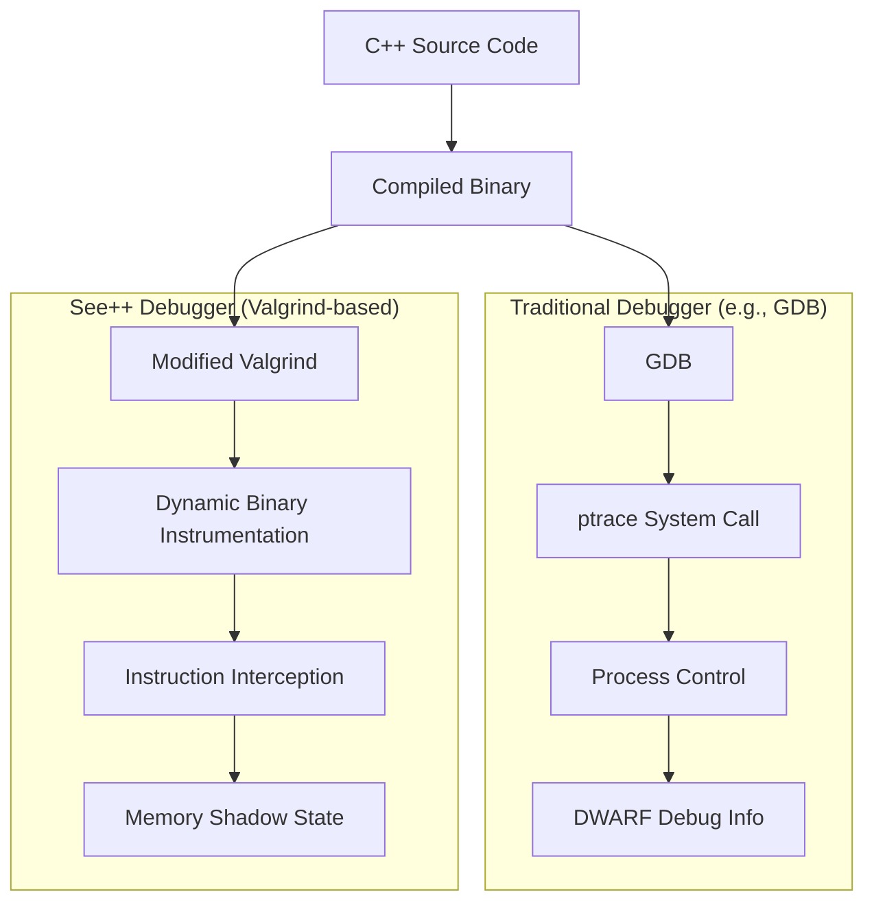

### Valgrind vs. Traditional Debuggers

| Aspect | Traditional Debugger (GDB) | Valgrind-based (See++) |
|--------|---------------------------|------------------------|
| **Method** | Process control (ptrace) | Dynamic binary instrumentation |
| **Overhead** | Low (~2x slowdown) | High (~20-50x slowdown) |
| **Memory Visibility** | Stack & registers only | Full memory graph (stack + heap) |
| **Live Debugging** | Yes (attach to running process) | No (post-mortem analysis only) |
| **Breakpoints** | Interactive breakpoints | Record all steps |
| **Watchpoints** | Hardware/software watchpoints | Memory access tracking |
| **Thread Support** | Full multi-threading | Single-threaded currently |
| **Performance** | Real-time interaction | Batch processing |

### How Valgrind Works

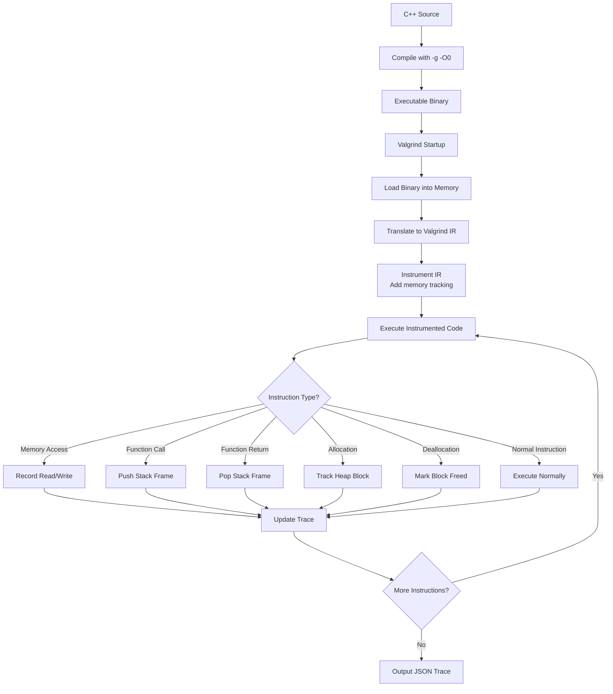

### SPP-Valgrind Modifications

The See++ project uses a modified version of Valgrind with custom instrumentation:

**Key Modifications**:
1. **JSON Trace Output**: Instead of text reports, output structured JSON
2. **Variable Value Tracking**: Extract variable values from memory using debug symbols
3. **Heap Relationship Tracking**: Identify pointer relationships between objects
4. **Stdout Interception**: Capture program output and sync with execution steps
5. **Line-level Granularity**: Record state at each source line, not just function boundaries

**Custom Valgrind Tool**: `lackey` (modified)
```bash
valgrind --tool=lackey \
         --trace-mem=yes \      # Track all memory operations
         --basic-counts=no \    # Disable default statistics
         --fnname=yes \         # Include function names
         --json-trace \         # Output JSON format
         ./program
```

### Integrating with VS Code Debugger APIs

VS Code provides several debugger-related APIs:

#### 1. Debug Adapter Protocol (DAP)

**Protocol Messages**:
- `initialize`: Capabilities negotiation
- `launch`/`attach`: Start debugging session
- `setBreakpoints`: Set breakpoints (can be simulated in trace)
- `continue`: Run until next breakpoint
- `next`: Step over
- `stepIn`: Step into function
- `stepOut`: Step out of function
- `stackTrace`: Get call stack
- `scopes`: Get variable scopes (local, global, heap)
- `variables`: Get variable values
- `evaluate`: Evaluate expression (limited in trace-based)

**Mapping Valgrind Trace to DAP**:

```typescript
// Convert ExecutionPoint to DAP StackFrame
function traceToStackFrame(point: ExecutionPoint): DebugProtocol.StackFrame[] {
    return point.stackToRender.map((frame, idx) => ({
        id: idx,
        name: frame.func_name,
        source: {
            path: frame.file_path,
            sourceReference: 0
        },
        line: frame.line,
        column: 0,
        presentationHint: idx === 0 ? 'normal' : 'subtle'
    }));
}

// Convert heap to DAP Variables
function heapToVariables(heap: any): DebugProtocol.Variable[] {
    return Object.entries(heap).map(([address, [value, type]]) => ({
        name: address,
        value: value,
        type: type,
        variablesReference: 0,
        presentationHint: { kind: 'data' }
    }));
}
```

#### 2. Debug Session API

```typescript
import * as vscode from 'vscode';

// Start debug session programmatically
vscode.debug.startDebugging(
    undefined,  // workspace folder
    {
        type: 'spp-cpp',
        name: 'See++ Debug',
        request: 'launch',
        program: '${file}'
    }
);

// Listen to debug events
vscode.debug.onDidStartDebugSession(session => {
    console.log('Started debug session:', session.name);
});

vscode.debug.onDidTerminateDebugSession(session => {
    console.log('Terminated debug session:', session.name);
});

// Send custom requests to debug adapter
vscode.debug.activeDebugSession?.customRequest('getHeapState').then(heap => {
    // Update visualization panel
    visualizationPanel.updateHeap(heap);
});
```

#### 3. Debug Console API

```typescript
// Write to debug console
vscode.debug.activeDebugConsole.appendLine('See++ trace loaded');

// Handle console input
// (automatically routed to debug adapter's evaluate request)
```

#### 4. Breakpoint API

```typescript
// Get all breakpoints
const breakpoints = vscode.debug.breakpoints;

// Add breakpoint programmatically
const bp = new vscode.SourceBreakpoint(
    new vscode.Location(
        vscode.Uri.file('/path/to/file.cpp'),
        new vscode.Position(10, 0)
    ),
    true  // enabled
);
vscode.debug.addBreakpoints([bp]);

// Simulate breakpoints in trace-based debugging
function shouldStopAtBreakpoint(
    point: ExecutionPoint,
    breakpoints: vscode.Breakpoint[]
): boolean {
    return breakpoints.some(bp => 
        bp instanceof vscode.SourceBreakpoint &&
        bp.location.uri.fsPath === point.filePath &&
        bp.location.range.start.line === point.line - 1
    );
}
```

### Hybrid Debugging Approach

Since Valgrind-based debugging is post-mortem (not live), we can implement a **hybrid approach**:

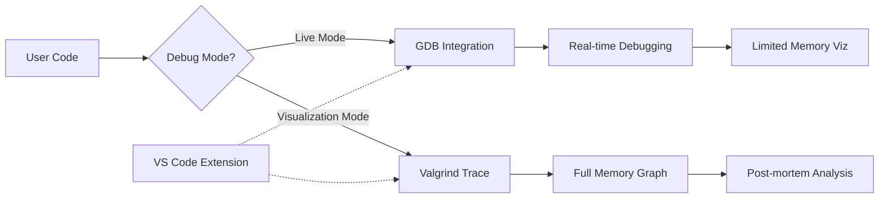

**Live Mode (GDB-based)**:
- Real-time debugging with breakpoints
- Fast execution
- Limited memory visualization
- Standard DAP implementation

**Visualization Mode (Valgrind-based)**:
- Full memory graph
- Complete execution trace
- Slower execution
- Rich visualizations

**Implementation Strategy**:
```typescript
// In launch.json
{
    "type": "spp-cpp",
    "request": "launch",
    "name": "See++ Debug",
    "program": "${file}",
    "mode": "visualization",  // or "live"
    "backend": "http://localhost:3000"
}

// In debug adapter
if (args.mode === 'live') {
    // Use GDB/LLDB as underlying debugger
    // Provide limited visualization
} else {
    // Use Valgrind trace
    // Provide full visualization
}
```

### Performance Considerations

**Valgrind Overhead**:
- Typical slowdown: 20-50x
- For a 1-second program: 20-50 seconds
- Lambda timeout: 120 seconds max

**Optimization Strategies**:

1. **Progressive Loading**:
   ```typescript
   // Load trace incrementally
   async function* loadTraceStream(traceId: string) {
       for (let i = 0; i < totalSteps; i += 100) {
           const chunk = await fetchTraceChunk(traceId, i, i + 100);
           yield chunk;
       }
   }
   ```

2. **Trace Caching**:
   ```typescript
   // Cache traces by code hash
   const cacheKey = sha256(sourceCode);
   const cached = await cache.get(cacheKey);
   if (cached) return cached;
   ```

3. **Partial Trace Generation**:
   ```typescript
   // Only trace specific functions
   valgrind --trace-functions=main,processData ./program
   ```

### Technical Challenges & Solutions

#### Challenge 1: Async vs. Sync Debugging

**Problem**: DAP expects synchronous responses, but trace generation is async (5-120 seconds)

**Solution**: Show progress during trace generation
```typescript
protected async launchRequest(
    response: DebugProtocol.LaunchResponse,
    args: LaunchRequestArguments
) {
    // Send response immediately
    this.sendResponse(response);
    
    // Show progress
    this.sendEvent(new OutputEvent(
        'Generating execution trace...\n',
        'stdout'
    ));
    
    // Generate trace asynchronously
    this.traceData = await generateTrace(args.program);
    
    // Now send initialized event
    this.sendEvent(new InitializedEvent());
    this.sendEvent(new StoppedEvent('entry', 1));
}
```

#### Challenge 2: Memory-intensive Traces

**Problem**: Large programs generate huge traces (>100MB JSON)

**Solution**: Stream processing and lazy loading
```typescript
class StreamedTrace {
    private chunks: Map<number, ExecutionPoint[]> = new Map();
    
    async getStep(index: number): Promise<ExecutionPoint> {
        const chunkIndex = Math.floor(index / 100);
        if (!this.chunks.has(chunkIndex)) {
            await this.loadChunk(chunkIndex);
        }
        return this.chunks.get(chunkIndex)![index % 100];
    }
}
```

#### Challenge 3: Breakpoint Simulation

**Problem**: Can't set real breakpoints in post-mortem trace

**Solution**: Fast-forward to breakpoint locations
```typescript
function findNextBreakpoint(
    trace: ExecutionPoint[],
    currentStep: number,
    breakpoints: Breakpoint[]
): number {
    for (let i = currentStep + 1; i < trace.length; i++) {
        if (matchesBreakpoint(trace[i], breakpoints)) {
            return i;
        }
    }
    return trace.length - 1;
}
```

#### Challenge 4: Expression Evaluation

**Problem**: Can't evaluate arbitrary expressions in post-mortem trace

**Solution**: Limited evaluation of known variables
```typescript
protected async evaluateRequest(
    response: DebugProtocol.EvaluateResponse,
    args: DebugProtocol.EvaluateArguments
) {
    const step = this.traceData.trace[this.currentStep];
    
    // Try to find variable in current scope
    const variable = findVariable(step, args.expression);
    
    if (variable) {
        response.body = {
            result: variable.value,
            type: variable.type,
            variablesReference: 0
        };
    } else {
        response.body = {
            result: 'Cannot evaluate expression in trace mode',
            variablesReference: 0
        };
    }
    
    this.sendResponse(response);
}
```

---

## Implementation Roadmap

### Phase 1: Foundation (1-2 months)

**Goal**: Establish VS Code extension structure and basic DAP implementation

**Tasks**:
- [ ] Set up VS Code extension project structure
- [ ] Implement basic Debug Adapter
  - [ ] Initialize/launch requests
  - [ ] Thread/stack trace requests
  - [ ] Variable requests
- [ ] Create minimal webview for visualization
- [ ] Test with simple C++ programs
- [ ] Documentation for extension development

**Deliverables**:
- Working VS Code extension (alpha)
- Basic debugging functionality (step forward/backward)
- Simple memory visualization in webview

### Phase 2: Enhanced Debugging (2-3 months)

**Goal**: Implement full DAP features and improved visualization

**Tasks**:
- [ ] Implement all DAP requests
  - [ ] Breakpoint simulation
  - [ ] Variable evaluation (limited)
  - [ ] Continue/pause functionality
- [ ] Enhance webview visualization
  - [ ] Port existing Konva.js visualization
  - [ ] Add interactive heap exploration
  - [ ] Implement pointer highlighting
- [ ] Optimize trace loading performance
- [ ] Add trace caching
- [ ] Write automated tests

**Deliverables**:
- Feature-complete debug adapter
- Rich memory visualization
- Performance optimizations
- Test suite

### Phase 3: IDE Integration (1-2 months)

**Goal**: Deep integration with VS Code features

**Tasks**:
- [ ] Code actions and IntelliSense integration
- [ ] Problem markers for memory leaks
- [ ] Hover providers for variable values
- [ ] Settings UI for backend configuration
- [ ] Multi-file project support
- [ ] Remote backend support

**Deliverables**:
- Seamless IDE integration
- Configuration UI
- Multi-project support

### Phase 4: Advanced Features (2-3 months)

**Goal**: Implement advanced debugging features

**Tasks**:
- [ ] Conditional breakpoints
- [ ] Data breakpoints (break on value change)
- [ ] Logpoints
- [ ] Watch expressions
- [ ] Time-travel debugging UI
- [ ] 3D memory visualization (optional)
- [ ] Multi-threading support (requires Valgrind updates)

**Deliverables**:
- Advanced debugging features
- Enhanced visualizations
- Multi-threading support

### Phase 5: Production Ready (1 month)

**Goal**: Polish, documentation, and marketplace release

**Tasks**:
- [ ] Comprehensive documentation
- [ ] Video tutorials
- [ ] Performance profiling and optimization
- [ ] Security review
- [ ] Marketplace preparation
- [ ] Marketing materials

**Deliverables**:
- VS Code Marketplace release
- Complete documentation
- Tutorial videos
- Marketing website

### Total Timeline: 7-11 months

---

## Conclusion

See++ is a well-architected C++ visualization tool with a solid foundation. The key strengths are:

1. **Clean Architecture**: Separation of concerns between frontend, backend, and execution
2. **Modern Infrastructure**: Serverless execution with AWS Lambda
3. **Security-First**: Isolated execution environments
4. **Extensible Design**: Runner abstraction allows multiple execution backends

The main gaps compared to modern stacks are:
1. **No CI/CD pipeline** (highest priority)
2. **Limited testing** (critical for reliability)
3. **No VS Code integration** (high impact feature)
4. **Outdated frontend** (being addressed with new React 19 frontend)

**Converting to a VS Code extension is highly feasible** and would provide significant value by:
- Integrating debugging into developer workflow
- Leveraging Debug Adapter Protocol standard
- Reusing existing backend infrastructure
- Providing rich memory visualizations in-IDE

The recommended approach is a **hybrid debugging model**:
- Live mode with GDB for fast interactive debugging
- Visualization mode with Valgrind for complete memory analysis

This provides the best of both worlds: real-time debugging when needed, and comprehensive visualization when teaching or debugging complex memory issues.

The implementation would take approximately 7-11 months following the phased roadmap, with a working MVP in 1-2 months and a production-ready extension in under a year.
